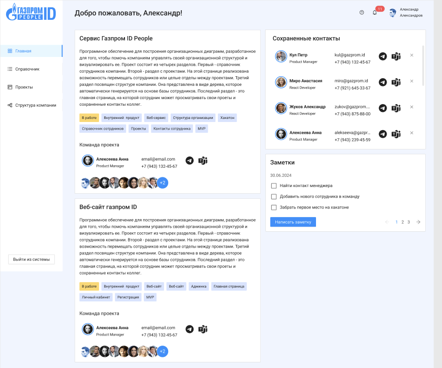
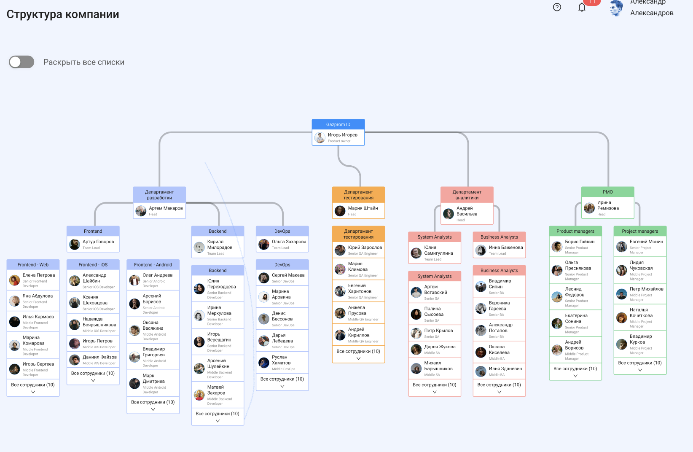

# Gazprom_id_people
* [Админ-панель джанго](http://gazprompeopleid.ddns.net/admin/)

Тестовый суперпользователь
```
{
    "email": "example@mail.ru",
    "password" : "1111",

}
```
* [Документация Swagger](http://gazprompeopleid.ddns.net/api/swagger/)

### Стэк технологий
* Django
* Django DRF
* Python 3.12
* Gunicorn
* Nginx
* Docker
* PostgreSQL

### Используемые библиотеки
* [Djoser](https://djoser.readthedocs.io/en/latest/introduction.html)
* [django-phonenumbers](https://pypi.org/project/django-phonenumbers/)
* [django-colorfield](https://pypi.org/project/django-colorfield/)
* [djangorestframework-simplejwt](https://django-rest-framework-simplejwt.readthedocs.io/en/latest/)

### Запуск приложения через докер

1. Клонировать репозиторий<br>
```
git clone git@github.com:TatianaBelova333/Gazprom_id_people.git

```

2. В корне проекта создать файл .env по типу env.example.

3. Перейти в папку infra из корня проекта<br>
```
cd infra

```
4. Выполнить следующие команды<br>
- Запустить приложение в контейнерах
```
docker compose up
```
- Создать миграции
```
docker compose exec backend python manage.py makemigrations
```
- Применить миграции
```
docker compose exec backend python manage.py migrate
```
- Заполнить базу тестовыми данными

```
docker compose exec backend python manage.py loaddata skill status company office timezone position progress_status tag department company_team company_unit employee project service component
```

- Собрать статику
```
docker compose exec backend python manage.py collectstatic
```
- Скопировать статику в волюм
```
docker compose exec backend cp -r /app/collected_static/. /backend_static/static/

```
- Создать суперпользователя
```
docker compose exec backend python manage.py createsuperuser
```

- Тестовый суперпользователь
```
{
    "email": "example@mail.ru",
    "password" : "1111",

}
```
### Примеры API запросов.
Документация - http://127.0.0.1/api/swagger/

Новый пользователь создается через админ-панель django другим пользователем с правами администратора. При создании необходимо указать email, пароль и роль учетной записи.
Все ендпоинты доступны только авторизованных пользователям.<br>
Пользователи с правами администратора могут редактировать профили других пользователей,
а также создавать и редактировать проекты, сервисы и компоненты.

#### Аутентификация по JWT-токену.

`GET /api/v1/auth/jwt/create/`

```
HTTP/1.1 200 OK
Content-Type: application/json

{
  "access": "string",
  "refresh": "string"
}

```
#### Главная страница. Получение списка проектов и контактов текущего пользователя.


`GET /api/v1/users/me/projects/`<br>

```
HTTP/1.1 200 OK
Content-Type: application/json
[
    {
        "id": 1,
        "name": "Веб-сайт Сервис Газпром ID People",
        "description": "Программное обеспечение для построения организационных диаграмм, разработанное для того, чтобы помочь компаниям управлять своей организационной структурой и визуализировать ее. Проект состоит из четырех разделов. Первый - справочник сотрудников компании. Второй - раздел с проектами. На этой странице реализована возможность перемещать сотрудников или целые отделы между проектами. Третий раздел посвящен структуре компании. Она представлена в виде дерева, которое автоматически генерируется на основе базы сотрудников. Последний раздел - это главная страница, на которой сотрудник может просматривать свои проекты и сохраненные контакты коллег...",
        "status": {
            "id": 3,
            "name": "На ревью",
            "color": "#87E8DE"
        },
        "start_date": "2024-09-01",
        "end_date": "2024-09-30",
        "tags": [
            {
                "id": 8,
                "name": "MVP",
                "color": "#D6E4FF"
            },
            {
                "id": 2,
                "name": "Веб-сервис",
                "color": "#D6E4FF"
            }
        ],
        "team_members": [
            {
                "id": 3,
                "image": "/media/Employee/makarov-artem-sergeevich/artem_makarov.png",
                "employment_type": 0
            },
            {
                "id": 62,
                "image": "/media/Employee/monin-e-s-pm-team-lead/Screenshot_2024-08-10_at_12.57.52.png",
                "employment_type": 0
            },
            {
                "id": 10,
                "image": "/media/Employee/abdulova-ya-s-senior-frontend-developer/Screenshot_2024-08-09_at_22.02.40.png",
                "employment_type": 0
            }
        ],
        "team_extra_count": 0,
        "director": {
            "id": 27,
            "full_name": "Баженова Инна Александровна",
            "position": {
                "id": 40,
                "name": "BA Team Lead"
            },
            "phone_number": "+79142186904",
            "telegram": "https://t.me/Inna1",
            "email": "bazhenova@gazprom.id",
            "image": null,
            "employment_type": 0,
            "ms_teams": "inna@yandex.ru"
        }
    }
]
```
`GET /api/v1/users/me/contacts/` <br>

```
HTTP/1.1 200 OK
Content-Type: application/json
[
    {
        "user_id": 1,
        "full_name": "Белова Татьяна Сергеевна",
        "position": "Junior BA",
        "phone_number": "+79142186902",
        "telegram": "https://t.me/Tanya333_B",
        "email": "admin1@mail.ru",
        "image": "",
        "employment_type": 0,
        "ms_teams": "example@mail.ru"
    },
    {
        "user_id": 2,
        "full_name": "Сергеев Sergey Сергеевич",
        "position": "BA Team Lead",
        "phone_number": "+79092186902",
        "telegram": null,
        "email": "serge@mail.ru",
        "image": "",
        "employment_type": 0,
        "ms_teams": "sergey@mail.ru"
    }
]
```
#### Страница другого пользователя.

`GET /api/v1/users/3/` <br>

```
{
    "id": 10,
    "first_name": "Яна",
    "last_name": "Абдулова",
    "middle_name": "Сергеевна",
    "birthday": "1988-08-06",
    "about_me": "Люблю море и читать.",
    "phone_number": "+79134156890",
    "email": "abdulova@gazprom.id",
    "status": {
        "id": 1,
        "name": "На работе",
        "color": "#FFD666"
    },
    "skills": [
        {
            "id": 39,
            "name": "Android Studio",
            "color": "#D6E4FF"
        },
        {
            "id": 63,
            "name": "BPMN",
            "color": "#D6E4FF"
        }
    ],
    "image": "http://127.0.0.1/media/Employee/abdulova-ya-s-senior-frontend-developer/Screenshot_2024-08-09_at_22.02.40.png",
    "ms_teams": "abdulova@gmail.com",
    "is_saved_contact": false,
    "employment_type": 0,
    "office": {
        "id": 1,
        "address": "г. Москва, ул. Лесная, 16, стр.1"
    },
    "position": {
        "id": 6,
        "name": "Senior Frontend Developer"
    },
    "timezone": {
        "id": 2,
        "name": "Московское время (UTC+3)"
    },
    "unit": {
        "id": 1,
        "name": "Frontend - Web"
    },
    "company_team": {
        "id": 1,
        "name": "Frontend"
    },
    "manager": {
        "id": 8,
        "last_name": "Артем",
        "first_name": "Говоров",
        "image": null,
        "employment_type": 0
    },
    "projects": [
        {
            "id": 1,
            "name": "Веб-сайт Сервис Газпром ID People",
            "description": "Программное обеспечение для построения организационных диаграмм, разработанное для того, чтобы помочь компаниям управлять своей организационной структурой и визуализировать ее. Проект состоит из четырех разделов. Первый - справочник сотрудников компании. Второй - раздел с проектами. На этой странице реализована возможность перемещать сотрудников или целые отделы между проектами. Третий раздел посвящен структуре компании. Она представлена в виде дерева, которое автоматически генерируется на основе базы сотрудников. Последний раздел - это главная страница, на которой сотрудник может просматривать свои проекты и сохраненные контакты коллег...",
            "status": {
                "id": 3,
                "name": "На ревью",
                "color": "#87E8DE"
            },
            "start_date": "2024-09-01",
            "end_date": "2024-09-30",
            "tags": [
                {
                    "id": 8,
                    "name": "MVP",
                    "color": "#D6E4FF"
                },
                {
                    "id": 2,
                    "name": "Веб-сервис",
                    "color": "#D6E4FF"
                }
            ],
            "team_members": [
                {
                    "id": 3,
                    "image": "/media/Employee/makarov-artem-sergeevich/artem_makarov.png",
                    "employment_type": 0
                },
                {
                    "id": 62,
                    "image": "/media/Employee/monin-e-s-pm-team-lead/Screenshot_2024-08-10_at_12.57.52.png",
                    "employment_type": 0
                },
                {
                    "id": 10,
                    "image": "/media/Employee/abdulova-ya-s-senior-frontend-developer/Screenshot_2024-08-09_at_22.02.40.png",
                    "employment_type": 0
                }
            ],
            "team_extra_count": 0,
            "director": {
                "id": 27,
                "full_name": "Баженова Инна Александровна",
                "position": {
                    "id": 40,
                    "name": "BA Team Lead"
                },
                "phone_number": "+79142186904",
                "telegram": "https://t.me/Inna1",
                "email": "bazhenova@gazprom.id",
                "image": null,
                "employment_type": 0,
                "ms_teams": "inna@yandex.ru"
            }
        }
    ]
}
```
#### Получение организационной структуры компании


`GET /api/v1/structures/` <br>

```
[
    {
        "id": 2,
        "company_name": "Gazprom ID",
        "director": {
            "id": 9,
            "image": "http://127.0.0.1/media/Employee/igorev-igor-igorevich/Screenshot_2024-08-08_at_15.47.20.png",
            "employment_type": 0,
            "first_name": "Игорь",
            "last_name": "Игорев",
            "position": {
                "id": 1,
                "name": "Product Owner"
            }
        },
        "departments": [
            {
                "id": 1,
                "name": "Департамент разработки",
                "head": {
                    "id": 3,
                    "image": "http://127.0.0.1/media/Employee/makarov-artem-sergeevich/artem_makarov.png",
                    "employment_type": 0,
                    "first_name": "Артем",
                    "last_name": "Макаров",
                    "position": {
                        "id": 36,
                        "name": "Backend Head"
                    }
                },
                "teams": [
                    {
                        "id": 2,
                        "name": "Backend",
                        "team_lead": {
                            "id": 25,
                            "image": "http://127.0.0.1/media/Employee/miloradov-kirill-kirillovich/Screenshot_2024-08-08_at_20.46.03.png",
                            "employment_type": 0,
                            "first_name": "Кирилл",
                            "last_name": "Милорадов",
                            "position": {
                                "id": 21,
                                "name": "Backend Team Lead"
                            }
                        },
                        "units": [
                            {
                                "id": 12,
                                "name": "Backend",
                                "employees": [
                                    {
                                        "id": 29,
                                        "image": "http://127.0.0.1/media/Employee/merkulova-i-o-senior-backend-developer/Screenshot_2024-08-09_at_09.27.49.png",
                                        "employment_type": 1,
                                        "first_name": "Ирина",
                                        "last_name": "Меркулова",
                                        "position": {
                                            "id": 20,
                                            "name": "Senior Backend Developer"
                                        }
                                    },
                                    {
                                        "id": 31,
                                        "image": null,
                                        "employment_type": 0,
                                        "first_name": "Игорь",
                                        "last_name": "Верещагин",
                                        "position": {
                                            "id": 19,
                                            "name": "Middle Backend Developer"
                                        }
                                    },
                                    {
                                        "id": 35,
                                        "image": null,
                                        "employment_type": 0,
                                        "first_name": "Оксана",
                                        "last_name": "Лунина",
                                        "position": {
                                            "id": 18,
                                            "name": "Junior Backend Developer"
                                        }
                                    }
                                ]
                        ]
                    }
                ]
            }
        ]
    }
]
```
#### Страница со всеми проектами компании.
Участники проектов сгруппированы по отделам.

`GET api/v1/projects/`

```
[
    {
        "id": 1,
        "name": "Веб-сайт Сервис Газпром ID People",
        "status": {
            "id": 3,
            "name": "На ревью",
            "color": "#87E8DE"
        },
        "company_teams": [
            {
                "name": "Project managers",
                "employees": [
                    {
                        "id": 62,
                        "image": "/media/Employee/monin-e-s-pm-team-lead/Screenshot_2024-08-10_at_12.57.52.png",
                        "last_name": "Монин",
                        "first_name": "Евгений",
                        "employment_type": 0,
                        "position": {
                            "id": 44,
                            "name": "Project Managers Team Lead"
                        }
                    }
                ]
            },
            {
                "name": "Frontend",
                "employees": [
                    {
                        "id": 10,
                        "image": "/media/Employee/abdulova-ya-s-senior-frontend-developer/Screenshot_2024-08-09_at_22.02.40.png",
                        "last_name": "Абдулова",
                        "first_name": "Яна",
                        "employment_type": 0,
                        "position": {
                            "id": 6,
                            "name": "Senior Frontend Developer"
                        }
                    },
                    {
                        "id": 67,
                        "image": null,
                        "last_name": "",
                        "first_name": "Татьяна",
                        "employment_type": 1,
                        "position": null
                    }
                ]
            }
        ]        
]
```

### Team

* Александра Петелина - PM<br>
* Артем Пацев - PdM<br>
* Ольга Гамаюнова - Старший в направлении design<br>
* Дмитрий Логунков - design<br>
* Екатерина Гадасина - design<br>
* Виктория Собко - design<br>
* Татьяна Луконина - design<br>
* Кирилл Ковригин - старший в направлении SA<br>
* Екатерина Байзигитова -  SA<br>
* Дарья Учаева -страший в направлении BA<br>
* Беклемышев Андрей - BA<br>
* Анастасия Лазарева - Frontend<br>
* Татьяна Белова - Backend<br>
* Кирилл Новиков -  QA<br>
